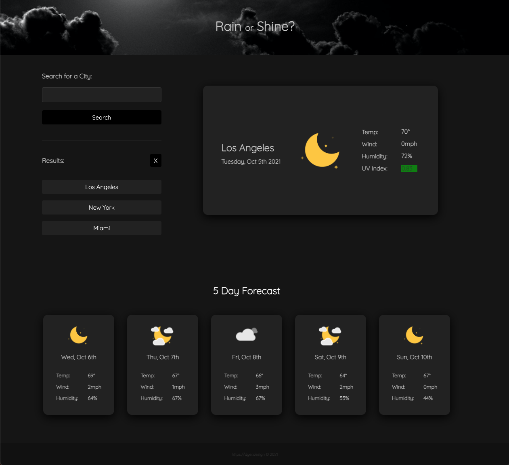

# Rain-or-Shine?

<br/>
## Repo Contents

<li>README.md</li>
<li>index.html</li>
<li>style.css</li>
<li>script.js</li>
<li>reset.css</li>
<li>assets</li>
<li>Deployed URL</li>

<br/>

Using the [OpenWeather One Call API](https://openweathermap.org/api/one-call-api), this app will retrieve weather data for users' city input, providing weather details for day-of, along with a 5-day forecast. Between the hours of 8pm-4am local time, the app will feature a darkmode styling.

<br/>

## User Story

```
AS A traveler
I WANT to see the weather outlook for multiple cities
SO THAT I can plan a trip accordingly.
```

<br/>

## Screenshots


<br />


<br/>

## Criteria

```
User greeted with input field, search prompt and button to begin.

When valid city name provided, user is presented with current and future weather conditions.

Search results are added to history under results heading, and persist in local storage.

User is provided with date, gif representation of condition, temp, wind speed, and humidity.

UV Index is available for current day with color scale for severity.

Future conditions include a 5 day forecast beyond current date.

When selecting from search history, user is again presented with results for saved city.

User can store 5 cities max, and clear results button will erase local storage.
```

## Deployed URL

https://github.com/djdyer/rain-or-shine
<br />
https://djdyer.github.io/rain-or-shine
<br />
